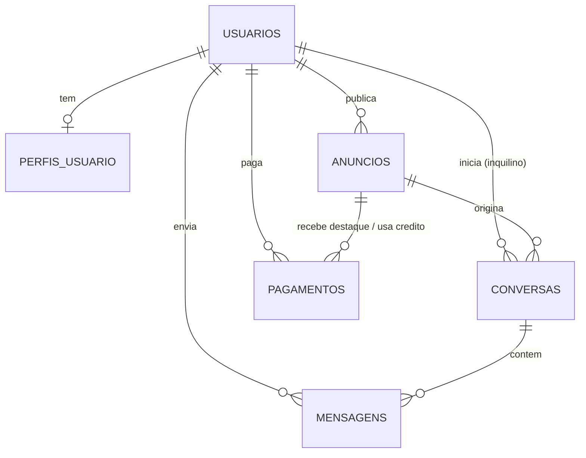

# Banco de dados

Oracle Database 21c Express Edition, schema `RACHAAI`, serviço `XEPDB1`.
Todas as tabelas e colunas têm nome em português, e os valores guardados são por
extenso (`SIM`/`NAO`, `ALUGAR`/`ANUNCIAR`), sem `0`/`1`.

As tabelas são criadas e alteradas **só por migrations do Flyway**
(`backend/src/main/resources/db/migration`). O Hibernate está em `ddl-auto: validate`:
ele nunca cria nem altera tabela, só confere se o código bate com o banco e se recusa a
subir se não bater.

## Diagrama



## Tabelas

Convenção: `id` é `NUMBER` gerado automaticamente (identity). Datas/horas são `TIMESTAMP`
(UTC). "Sim/Não" é `VARCHAR2(3)` com `'SIM'` ou `'NAO'`; **nulo significa "não informado"**.

### `usuarios`
Uma linha por conta.

| Coluna | Tipo | Descrição |
|---|---|---|
| `id` | NUMBER | chave primária |
| `nome` | VARCHAR2(120) | nome completo |
| `email` | VARCHAR2(180) | login; **único** (guardado em minúsculas) |
| `senha_hash` | VARCHAR2(255) | senha com hash BCrypt (nunca a senha pura) |
| `data_nascimento` | DATE | |
| `papel` | VARCHAR2(20) | `ALUGAR` (procura lugar) ou `ANUNCIAR` (publica anúncios). Definido no cadastro e não muda |
| `ocupacao` | VARCHAR2(160) | curso/faculdade ou profissão |
| `bio` | VARCHAR2(1000) | texto "sobre mim" |
| `criado_em` | TIMESTAMP | |

### `perfis_usuario`
Hábitos de convivência (1 para 1 com `usuarios`). Alimenta o cálculo de compatibilidade.

| Coluna | Tipo | Descrição |
|---|---|---|
| `usuario_id` | NUMBER | FK para `usuarios`; único |
| `fumante`, `bebe`, `vegetariano`, `tem_pets`, `gosta_animais` | VARCHAR2(3) | `SIM` / `NAO` / nulo |
| `alergias` | VARCHAR2(500) | texto livre |
| `gosto_musical` | VARCHAR2(500) | estilos separados por vírgula |
| `rotina` | VARCHAR2(20) | `DIURNO`, `NOTURNO` ou `MISTO` |
| `atualizado_em` | TIMESTAMP | |

### `anuncios`
Os três tipos de anúncio da plataforma.

| Coluna | Tipo | Descrição |
|---|---|---|
| `usuario_id` | NUMBER | dono do anúncio (FK) |
| `tipo` | VARCHAR2(20) | `PROCURANDO` (quem aluga descreve o que busca), `TEM_VAGA` (vaga para dividir), `ESTABELECIMENTO` (imóvel inteiro) |
| `titulo`, `descricao` | VARCHAR2 | |
| `bairro_preferido` | VARCHAR2(160) | bairro (do imóvel ou o desejado) |
| `faculdade_proxima` | VARCHAR2(160) | faculdade de referência |
| `preco` | NUMBER(10,2) | valor da vaga/aluguel/orçamento |
| `endereco`, `latitude`, `longitude` | | só em `TEM_VAGA` e `ESTABELECIMENTO` (aparece no mapa) |
| `aceita_pets`, `aceita_fumante` | VARCHAR2(3) | só em `ESTABELECIMENTO`: o que o dono aceita de inquilino |
| `ativo` | VARCHAR2(3) | `SIM` / `NAO`. Remover um anúncio só muda para `NAO` (não apaga a linha) |
| `expira_em` | TIMESTAMP | só anúncios **extras** (pagos) têm validade; **nulo = anúncio grátis, sem validade** |
| `destaque_ate` | TIMESTAMP | enquanto for futuro, o anúncio está em destaque |
| `criado_em` | TIMESTAMP | |

Regras garantidas pelo próprio banco:
- `tipo` só aceita os 3 valores; `ativo`, `aceita_*` só `SIM`/`NAO`.
- **Uma busca ativa por usuário:** índice único por expressão
  (`uq_anuncios_uma_busca_por_usuario`). O Oracle não tem índice parcial, então o índice usa
  `CASE WHEN ativo = 'SIM' AND tipo = 'PROCURANDO' THEN usuario_id END`; como valores nulos não
  entram no índice, só a busca ativa conta.

### `conversas`
Uma conversa é sempre sobre um anúncio e iniciada por quem aluga.

| Coluna | Tipo | Descrição |
|---|---|---|
| `anuncio_id` | NUMBER | anúncio em questão (FK) |
| `inquilino_id` | NUMBER | quem iniciou (FK para `usuarios`) |
| `criado_em` | TIMESTAMP | |

`UNIQUE (anuncio_id, inquilino_id)`: clicar em "Conversar" duas vezes reabre a mesma conversa.
Quem anuncia enxerga a conversa pelo dono do anúncio.

### `mensagens`

| Coluna | Tipo | Descrição |
|---|---|---|
| `conversa_id` | NUMBER | FK para `conversas` |
| `remetente_id` | NUMBER | FK para `usuarios` |
| `conteudo` | VARCHAR2(2000) | texto |
| `enviado_em` | TIMESTAMP | |

### `pagamentos`
Compras de quem anuncia. Ver [06-COBRANCA.md](06-COBRANCA.md).

| Coluna | Tipo | Descrição |
|---|---|---|
| `usuario_id` | NUMBER | quem comprou (FK) |
| `anuncio_id` | NUMBER | `DESTAQUE`: anúncio que foi destacado. `ANUNCIO_EXTRA`: **nulo = crédito ainda não usado**; depois de usado, o anúncio criado com ele |
| `tipo` | VARCHAR2(20) | `ANUNCIO_EXTRA` ou `DESTAQUE` |
| `valor` | NUMBER(10,2) | valor cobrado, em reais (congelado no momento da compra) |
| `status` | VARCHAR2(20) | `PENDENTE`, `PAGO` ou `CANCELADO` |
| `referencia_externa` | VARCHAR2(100) | id no gateway de pagamento (no modo simulado: `SIMULADO-...`) |
| `criado_em`, `pago_em` | TIMESTAMP | |
| `versao` | NUMBER | controle de concorrência: impede gastar o mesmo crédito duas vezes |

## Migrations (histórico)

| Versão | Arquivo | O que faz |
|---|---|---|
| V1 | `V1__init.sql` | cria as tabelas (ainda com nomes em inglês) |
| V2 | `V2__nomes_em_portugues.sql` | renomeia tabelas, colunas, constraints e índices para português |
| V3 | `V3__valores_por_extenso.sql` | troca `0`/`1` por `NAO`/`SIM` e `RENTER`/`ADVERTISER` por `ALUGAR`/`ANUNCIAR` |
| V4 | `V4__pagamentos_e_destaques.sql` | cria `pagamentos` e as colunas `expira_em` e `destaque_ate` |

Para ver o que já foi aplicado: `SELECT "version", "description", "success" FROM "flyway_schema_history";`
(o nome da tabela é minúsculo e precisa de aspas).

## Mapeamento código ↔ banco

O código Java e a API JSON continuam em inglês (`User`, `Listing`, `role: "RENTER"`,
`true`/`false`); só o banco é em português. A tradução é feita nas entidades
(`@Table`/`@Column`) e em dois conversores JPA:

- `SimNaoConverter` (`common/`): `true`/`false`/nulo ⇄ `SIM`/`NAO`/nulo
- `RoleConverter` (`user/`): `RENTER`/`ADVERTISER` ⇄ `ALUGAR`/`ANUNCIAR`

## Consultas úteis

```sql
-- quem são os usuários
SELECT id, nome, email, papel FROM usuarios ORDER BY id;

-- anúncios ativos, com validade e destaque
SELECT u.nome, a.tipo, a.titulo, a.ativo, a.expira_em, a.destaque_ate
  FROM anuncios a JOIN usuarios u ON u.id = a.usuario_id
 WHERE a.ativo = 'SIM' ORDER BY a.id;

-- pagamentos
SELECT u.nome, p.tipo, p.valor, p.status, p.anuncio_id, p.pago_em
  FROM pagamentos p JOIN usuarios u ON u.id = p.usuario_id ORDER BY p.id;

-- créditos de anúncio extra pagos e ainda não usados, por usuário
SELECT usuario_id, COUNT(*) AS creditos
  FROM pagamentos
 WHERE tipo = 'ANUNCIO_EXTRA' AND status = 'PAGO' AND anuncio_id IS NULL
 GROUP BY usuario_id;

-- conversas com quantidade de mensagens
SELECT c.id, c.anuncio_id, c.inquilino_id, COUNT(m.id) AS mensagens
  FROM conversas c LEFT JOIN mensagens m ON m.conversa_id = c.id
 GROUP BY c.id, c.anuncio_id, c.inquilino_id;
```
