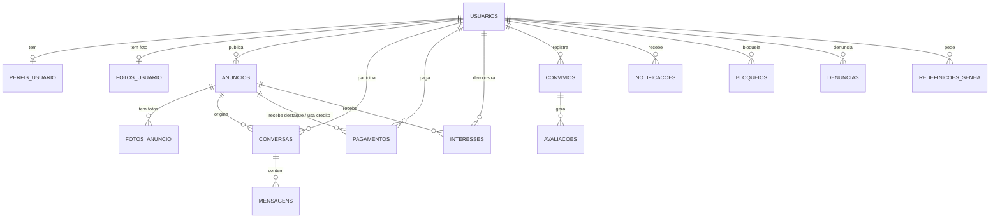

# Banco de dados

Oracle Database 21c Express Edition, schema `RACHAAI`, serviço `XEPDB1`.
Todas as tabelas e colunas têm nome em português. Os valores "sim/não" são guardados por
extenso (`SIM`/`NAO`), sem `0`/`1`.

As tabelas são criadas e alteradas **só por migrations do Flyway**
(`backend/src/main/resources/db/migration`). O Hibernate está em `ddl-auto: validate`:
ele nunca cria nem altera tabela, só confere se o código bate com o banco e se recusa a
subir se não bater.

## Diagrama



## Tabelas

Convenção: `id` é `NUMBER` gerado automaticamente (identity). Datas/horas são `TIMESTAMP`
(UTC). "Sim/Não" é `VARCHAR2(3)` com `'SIM'` ou `'NAO'`; **nulo significa "não informado"**.

### `usuarios`
Uma linha por conta.

| Coluna | Tipo | Descrição |
|---|---|---|
| `id` | NUMBER | chave primária |
| `nome` | VARCHAR2(120) | nome completo |
| `email` | VARCHAR2(180) | login; **único** (guardado em minúsculas) |
| `senha_hash` | VARCHAR2(255) | senha com hash BCrypt (nunca a senha pura) |
| `data_nascimento` | DATE | maior de 18 anos exigido no cadastro |
| `cpf` | VARCHAR2(11) | só dígitos; **único**; dígitos verificadores validados na aplicação (não consulta base externa). Nulo em contas antigas |
| `alugar` | NUMBER(1) | `1` se a conta pode procurar vaga (buscar, conversar, demonstrar interesse) |
| `anunciar` | NUMBER(1) | `1` se a conta pode publicar anúncios |
| `tipo_anunciante` | VARCHAR2(20) | `VAGA` ou `ESTABELECIMENTO`: o que a pessoa escolheu ao virar anunciante (é só a preferência inicial; cada anúncio escolhe seu próprio tipo) |
| `ocupacao` | VARCHAR2(160) | curso/faculdade ou profissão |
| `bio` | VARCHAR2(1000) | texto "sobre mim" |
| `termos_seguranca_aceito_em` | TIMESTAMP | nulo = ainda não aceitou o aviso de segurança |
| `criado_em` | TIMESTAMP | |

Regra do banco: `CHECK (alugar = 1 OR anunciar = 1)`. **Uma conta pode ter as duas
capacidades ao mesmo tempo** (procurar e anunciar); a coluna `papel` antiga deixou de existir na V17.

### `perfis_usuario`
Hábitos de convivência (1 para 1 com `usuarios`). Alimenta o cálculo de compatibilidade.

| Coluna | Tipo | Descrição |
|---|---|---|
| `usuario_id` | NUMBER | FK para `usuarios`; único |
| `sexo` | VARCHAR2(20) | `MASCULINO`, `FEMININO` ou `OUTRO`. Usado para filtrar vagas restritas por sexo |
| `habito_fumo` | VARCHAR2(30) | `NAO_FUMO`, `FUMO_SOCIALMENTE`, `FUMO_QUANDO_BEBO`, `FUMANTE`, `TENTANDO_PARAR` |
| `habito_bebida` | VARCHAR2(30) | `NAO_CURTO`, `PAREI_DE_BEBER`, `BEBO_COM_MODERACAO`, `OCASIOES_ESPECIAIS`, `SOCIALMENTE_FDS`, `QUASE_TODA_NOITE` |
| `alimentacao` | VARCHAR2(20) | `VEGETARIANO`, `VEGANO`, `OUTRO` na tela; o banco ainda aceita `ONIVORO`, `PESCETARIANO` e `FLEXITARIANO` (valores antigos que não aparecem mais como botão) |
| `alimentacao_outro` | VARCHAR2(160) | texto livre quando `alimentacao = 'OUTRO'` (apagado se a pessoa trocar de opção) |
| `pet_preferencias` | VARCHAR2(500) | opções separadas por vírgula (ex.: `CACHORRO,GATO`) |
| `alergias` | VARCHAR2(500) | tags separadas por vírgula; `OUTRO:texto livre` guarda o relato da pessoa. Na tela: Poeira, Pelo de animal, Alimentos, Nenhuma, Outro (as tags antigas, como Látex, continuam legíveis) |
| `gosto_musical` | VARCHAR2(500) | estilos separados por vírgula |
| `precisa_vaga_carro`, `precisa_vaga_moto` | VARCHAR2(3) | `SIM` / `NAO`: precisa de vaga de garagem para carro/moto. Os dois `NAO` = "não preciso"; nulo = não informado |
| `rotina` | VARCHAR2(20) | `DIURNO`, `NOTURNO` ou `MISTO` |
| `atualizado_em` | TIMESTAMP | |

### `fotos_usuario`
Foto de perfil, numa tabela à parte para o BLOB nunca ser carregado junto com o usuário.

| Coluna | Tipo | Descrição |
|---|---|---|
| `usuario_id` | NUMBER | FK; **único** (uma foto por pessoa) |
| `conteudo` | BLOB | a imagem |
| `tipo_conteudo` | VARCHAR2(50) | `image/jpeg`, `image/png` ou `image/webp` |
| `atualizado_em` | TIMESTAMP | |

### `anuncios`
Os dois tipos de anúncio da plataforma. (O tipo antigo `PROCURANDO` foi removido na V16.)

| Coluna | Tipo | Descrição |
|---|---|---|
| `usuario_id` | NUMBER | dono do anúncio (FK) |
| `tipo` | VARCHAR2(20) | `TEM_VAGA` (vaga para dividir) ou `ESTABELECIMENTO` (imóvel inteiro) |
| `titulo`, `descricao` | VARCHAR2 | |
| `bairro_preferido` | VARCHAR2(160) | bairro do imóvel |
| `faculdade_proxima` | VARCHAR2(160) | campo antigo; a tela não pede mais, mas anúncios antigos ainda o têm |
| `preco` | NUMBER(10,2) | `TEM_VAGA`: valor médio por pessoa. `ESTABELECIMENTO`: valor do aluguel |
| `vagas_disponiveis` | NUMBER(3) | só `TEM_VAGA`: quantas vagas estão abertas |
| `sexo_aceito` | VARCHAR2(20) | só faz efeito em `TEM_VAGA`: `QUALQUER` (padrão), `MASCULINO` ou `FEMININO` |
| `endereco`, `latitude`, `longitude` | | obrigatórios; aparecem no mapa e servem para a busca "por perto" |
| `aceita_pets`, `aceita_fumante` | VARCHAR2(3) | só em `ESTABELECIMENTO`: o que o dono aceita de inquilino |
| `dormitorios`, `suites`, `banheiros_sociais`, `vagas_garagem` | NUMBER(2) | os dois tipos, opcionais (nulo = não informado; ≥ 0). Suítes não podem passar do número de dormitórios (regra da aplicação) |
| `garagem_carro`, `garagem_moto` | VARCHAR2(3) | `SIM` / `NAO`: para que serve a garagem. Só gravados quando `vagas_garagem` > 0 |
| `garagem_disposicao` | VARCHAR2(20) | `GAVETA` (um carro atrás do outro) ou `LATERAL` (lado a lado). Só quando `vagas_garagem` > 0 |
| `garagem_coberta` | VARCHAR2(3) | `SIM` / `NAO`: vaga coberta. Só quando `vagas_garagem` > 0 |
| `piscina`, `salao_festas`, `academia`, `playground`, `portaria_24h` | VARCHAR2(3) | condomínio, os dois tipos: `SIM` / `NAO` / nulo (não informado). `playground` = playground e brinquedoteca |
| `ativo` | VARCHAR2(3) | `SIM` / `NAO`. Remover um anúncio só muda para `NAO` (não apaga a linha) |
| `disponivel` | VARCHAR2(3) | `SIM` / `NAO`. `NAO` = "marcado como indisponível" (negócio fechado); o anúncio some da busca |
| `fechado_com_usuario_id` | NUMBER | opcional: com quem o negócio foi fechado (precisa ter conversado com o dono) |
| `expira_em` | TIMESTAMP | só anúncios **extras** (pagos) têm validade; **nulo = anúncio grátis, sem validade** |
| `destaque_ate` | TIMESTAMP | enquanto for futuro, o anúncio está em destaque |
| `criado_em` | TIMESTAMP | |

Regras garantidas pelo próprio banco: `tipo` só aceita `TEM_VAGA`/`ESTABELECIMENTO`;
`sexo_aceito` só os 3 valores acima; `ativo`, `disponivel`, `aceita_*`, `garagem_*` e as
comodidades do condomínio só `SIM`/`NAO`; as quantidades não podem ser negativas.

### `fotos_anuncio`
Até 6 fotos por anúncio (limite aplicado pela aplicação), na mesma ideia de `fotos_usuario`.

| Coluna | Tipo | Descrição |
|---|---|---|
| `anuncio_id` | NUMBER | FK para `anuncios` |
| `conteudo` | BLOB | a imagem |
| `tipo_conteudo` | VARCHAR2(50) | `image/jpeg`, `image/png` ou `image/webp` (até 3 MB) |
| `ordem` | NUMBER(3) | posição; a primeira é a capa |
| `criado_em` | TIMESTAMP | |

### `interesses`
"Tenho interesse" em um `ESTABELECIMENTO`. Serve para pessoas interessadas no mesmo imóvel
poderem se ver e conversar entre si (dividir o aluguel).

| Coluna | Tipo | Descrição |
|---|---|---|
| `anuncio_id` | NUMBER | FK |
| `usuario_id` | NUMBER | quem se interessou (FK) |
| `criado_em` | TIMESTAMP | |

`UNIQUE (anuncio_id, usuario_id)`.

### `conversas`
Uma conversa é sempre sobre um anúncio. Há dois tipos:

- **com o dono:** `inquilino_id` conversa com o dono do anúncio (`usuario2_id` nulo);
- **entre interessados:** duas pessoas interessadas no mesmo estabelecimento conversam entre si
  (`usuario2_id` preenchido).

| Coluna | Tipo | Descrição |
|---|---|---|
| `anuncio_id` | NUMBER | anúncio em questão (FK) |
| `inquilino_id` | NUMBER | quem iniciou (FK para `usuarios`) |
| `usuario2_id` | NUMBER | só em conversa entre interessados: a outra pessoa |
| `criado_em` | TIMESTAMP | |

Dois índices únicos por expressão impedem conversas duplicadas: clicar em "Conversar" duas
vezes reabre a mesma conversa, e o par de interessados é o mesmo em qualquer ordem.

### `mensagens`

| Coluna | Tipo | Descrição |
|---|---|---|
| `conversa_id` | NUMBER | FK para `conversas` |
| `remetente_id` | NUMBER | FK para `usuarios` |
| `conteudo` | VARCHAR2(2000) | texto |
| `enviado_em` | TIMESTAMP | |

### `pagamentos`
Compras de quem anuncia. Ver [06-COBRANCA.md](06-COBRANCA.md).

| Coluna | Tipo | Descrição |
|---|---|---|
| `usuario_id` | NUMBER | quem comprou (FK) |
| `anuncio_id` | NUMBER | `DESTAQUE`: anúncio que foi destacado. `ANUNCIO_EXTRA`: **nulo = crédito ainda não usado**; depois de usado, o anúncio criado com ele |
| `tipo` | VARCHAR2(20) | `ANUNCIO_EXTRA` ou `DESTAQUE` |
| `valor` | NUMBER(10,2) | valor cobrado, em reais (congelado no momento da compra) |
| `status` | VARCHAR2(20) | `PENDENTE`, `PAGO` ou `CANCELADO` |
| `referencia_externa` | VARCHAR2(100) | id no gateway de pagamento (no modo simulado: `SIMULADO-...`) |
| `criado_em`, `pago_em` | TIMESTAMP | |
| `versao` | NUMBER | controle de concorrência: impede gastar o mesmo crédito duas vezes |

### `convivios` e `avaliacoes`
Só quem realmente morou junto pode avaliar. Um **convívio** é proposto por uma pessoa (com o
período em que moraram juntas) e só vale depois que a outra confirma.

| Tabela | Colunas principais |
|---|---|
| `convivios` | `usuario1_id` < `usuario2_id` (par sempre em ordem, então é único por casal), `proposto_por_id`, `periodo_inicio`, `periodo_fim`, `status` (`PENDENTE`, `CONFIRMADO`, `RECUSADO`), `criado_em`, `confirmado_em` |
| `avaliacoes` | `convivio_id`, `avaliador_id`, `avaliado_id`, `nota_pontualidade` e `nota_convivencia` (1 a 5), `comentario`, `criado_em`. Cada lado avalia o outro **uma vez** por convívio; ninguém avalia a si mesmo |

### `notificacoes`
Avisos dentro do site (o sino no topo). Tipos: `NOVA_MENSAGEM`, `NOVA_CONVERSA`,
`CONVIVIO_PROPOSTO`, `CONVIVIO_CONFIRMADO`, `CONVIVIO_RECUSADO`, `AVALIACAO_RECEBIDA`,
`NOVO_INTERESSE` (dono: alguém clicou em "Tenho interesse") e `INTERESSE_EM_COMUM` (há outros
interessados no mesmo imóvel).
Colunas: `usuario_id`, `tipo`, `titulo`, `mensagem`, `link`, `lida` (`SIM`/`NAO`), `criado_em`.
O site consulta de tempos em tempos (não há push nem websocket).

### `bloqueios` e `denuncias`
- **`bloqueios`** (`usuario_id` bloqueia `bloqueado_id`): ação de um lado só. Enquanto existir, as
  duas pessoas somem uma para a outra na busca e não trocam mais mensagens. Par único.
- **`denuncias`**: `denunciante_id`, `denunciado_id`, `conversa_id` (opcional), `motivo`
  (`COMPORTAMENTO_SUSPEITO`, `GOLPE_OU_FRAUDE`, `CONTEUDO_IMPROPRIO`, `ASSEDIO`, `OUTRO`),
  `descricao`. Só fica registrada; não há painel de moderação ainda.

### `redefinicoes_senha`
Pedidos de "esqueci minha senha". Guarda só o **hash SHA-256** do token (o token puro vai
apenas no link do e-mail), `usado` (`SIM`/`NAO`, uso único) e `criado_em`. O token vale
**30 minutos**.

## Migrations (histórico)

| Versão | Arquivo | O que faz |
|---|---|---|
| V1 | `V1__init.sql` | cria as tabelas (ainda com nomes em inglês) |
| V2 | `V2__nomes_em_portugues.sql` | renomeia tabelas, colunas, constraints e índices para português |
| V3 | `V3__valores_por_extenso.sql` | troca `0`/`1` por `NAO`/`SIM` e `RENTER`/`ADVERTISER` por `ALUGAR`/`ANUNCIAR` |
| V4 | `V4__pagamentos_e_destaques.sql` | cria `pagamentos` e as colunas `expira_em` e `destaque_ate` |
| V5 | `V5__convivios_e_avaliacoes.sql` | cria `convivios` e `avaliacoes` |
| V6 | `V6__termo_seguranca.sql` | `termos_seguranca_aceito_em` em `usuarios` |
| V7 | `V7__notificacoes.sql` | cria `notificacoes` |
| V8 | `V8__bloqueios_e_denuncias.sql` | cria `bloqueios` e `denuncias` |
| V9 | `V9__cpf_usuario.sql` | `cpf` (único) em `usuarios` |
| V10 | `V10__personalizacao_perfil_chips.sql` | perfil por opções: hábito de fumo/bebida, alimentação, pets e alergias em tags (migra os dados antigos de sim/não) |
| V11 | `V11__interesse_em_estabelecimento.sql` | cria `interesses`; `conversas.usuario2_id` (conversa entre interessados) |
| V12 | `V12__tipo_anunciante.sql` | `tipo_anunciante` em `usuarios` |
| V13 | `V13__anuncio_indisponivel.sql` | `disponivel` e `fechado_com_usuario_id` em `anuncios` |
| V14 | `V14__redefinicao_senha.sql` | cria `redefinicoes_senha` |
| V15 | `V15__foto_perfil.sql` | cria `fotos_usuario` |
| V16 | `V16__remove_procurando.sql` | apaga anúncios `PROCURANDO` e remove o tipo (a tela "Minha busca" deixou de existir) |
| V17 | `V17__papel_duplo.sql` | troca a coluna `papel` por `alugar`/`anunciar`: uma conta pode ter as duas capacidades |
| V18 | `V18__vagas_disponiveis.sql` | `vagas_disponiveis` em `anuncios` |
| V19 | `V19__fotos_anuncio.sql` | cria `fotos_anuncio` |
| V20 | `V20__alimentacao_outro.sql` | `alimentacao_outro` e a opção `OUTRO` em `alimentacao` |
| V21 | `V21__sexo_e_vaga_por_sexo.sql` | `sexo` em `perfis_usuario` e `sexo_aceito` em `anuncios` |
| V22 | `V22__detalhes_imovel.sql` | detalhes do imóvel em `anuncios`: dormitórios, banheiros, garagem e comodidades do condomínio |
| V23 | `V23__suites.sql` | `suites` em `anuncios` |
| V24 | `V24__garagem_disposicao_coberta.sql` | `garagem_disposicao` e `garagem_coberta` em `anuncios` |
| V25 | `V25__notificacoes_interesse.sql` | tipos `NOVO_INTERESSE` e `INTERESSE_EM_COMUM` em `notificacoes` |
| V26 | `V26__perfil_precisa_garagem.sql` | `precisa_vaga_carro` e `precisa_vaga_moto` em `perfis_usuario` |

Para ver o que já foi aplicado: `SELECT "version", "description", "success" FROM "flyway_schema_history";`
(o nome da tabela é minúsculo e precisa de aspas).

## Mapeamento código ↔ banco

O código Java e a API JSON usam nomes em inglês (`User`, `Listing`, `renter`, `advertiser`,
`true`/`false`); só o banco é em português. A tradução é feita nas entidades
(`@Table`/`@Column`) e em conversores JPA:

- `SimNaoConverter` (`common/`): `true`/`false`/nulo ⇄ `SIM`/`NAO`/nulo
- `AdvertiserKindConverter` (`user/`): `VAGA`/`ESTABELECIMENTO`

As duas capacidades da conta (`alugar`/`anunciar`) são simples colunas booleanas
(`renter`/`advertiser` no código).

## Consultas úteis

```sql
-- quem são os usuários e o que cada conta pode fazer
SELECT id, nome, email, alugar, anunciar, tipo_anunciante FROM usuarios ORDER BY id;

-- sexo e alimentação dos perfis
SELECT usuario_id, sexo, alimentacao, alimentacao_outro FROM perfis_usuario;

-- anúncios ativos, com validade, destaque, vagas e restrição de sexo
SELECT u.nome, a.tipo, a.titulo, a.vagas_disponiveis, a.sexo_aceito, a.expira_em, a.destaque_ate
  FROM anuncios a JOIN usuarios u ON u.id = a.usuario_id
 WHERE a.ativo = 'SIM' ORDER BY a.id;

-- quantas fotos cada anúncio tem
SELECT anuncio_id, COUNT(*) AS fotos FROM fotos_anuncio GROUP BY anuncio_id;

-- pagamentos
SELECT u.nome, p.tipo, p.valor, p.status, p.anuncio_id, p.pago_em
  FROM pagamentos p JOIN usuarios u ON u.id = p.usuario_id ORDER BY p.id;

-- créditos de anúncio extra pagos e ainda não usados, por usuário
SELECT usuario_id, COUNT(*) AS creditos
  FROM pagamentos
 WHERE tipo = 'ANUNCIO_EXTRA' AND status = 'PAGO' AND anuncio_id IS NULL
 GROUP BY usuario_id;

-- conversas com quantidade de mensagens
SELECT c.id, c.anuncio_id, c.inquilino_id, c.usuario2_id, COUNT(m.id) AS mensagens
  FROM conversas c LEFT JOIN mensagens m ON m.conversa_id = c.id
 GROUP BY c.id, c.anuncio_id, c.inquilino_id, c.usuario2_id;
```
